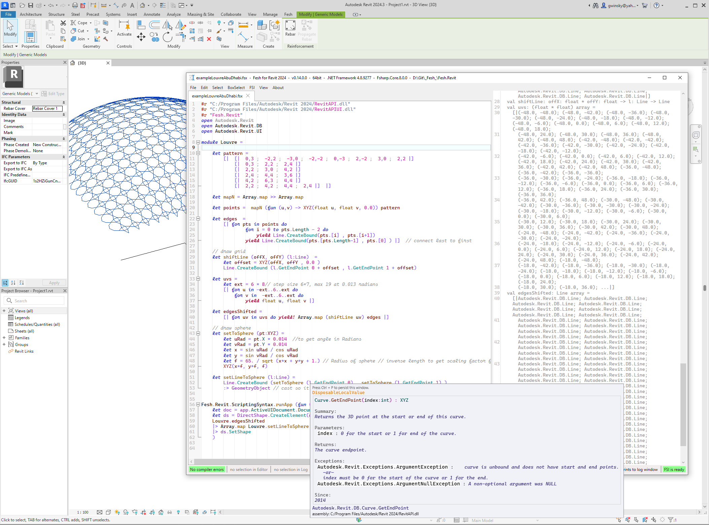

# Seff.Revit
 This repo contains a <a href="https://www.autodesk.com/products/revit/overview" target="_blank">Autodesk Revit</a> plugin to host Seff. Seff is a fsharp scripting editor based on <a href="https://github.com/icsharpcode/AvalonEdit" target="_blank">Avalonedit</a>. The editor supports the latest features of F# 5.0 via <a href="https://www.nuget.org/packages/FSharp.Compiler.Service/40.0.0" target="_blank">FCS 40.0.0</a>. It has (regex based) syntax highlighting, auto completion and typ info tooltips. The output log supports colorful text.
 
 

The example script in the root folder generates the axes for cladding of the Louvre Abu Dhabi.
See also my talk at <a href="https://www.youtube.com/watch?v=ZY-bvZZZZnE" target="_blank">FSharpConf 2016</a> 

### How to build
Befor compiling make sure the path in the file `Seff.addin` points to the correct location.
The `addin` file will then be copied to `C:/ProgramData/Autodesk/Revit/Addins/2021/Seff.addin` as the last step of the build process. See end of `.fsproj` files

### How to use F# with Revit
By default a f# script evaluation starts asynchronous on a new thread. The `Seff.Revit.dll` also provides utility functions to run <a href="https://knowledge.autodesk.com/support/revit-products/learn-explore/caas/CloudHelp/cloudhelp/2014/ENU/Revit/files/GUID-C946A4BA-2E70-4467-91A0-1B6BA69DBFBE-htm.html" target="_blank">synchronous transaction</a> on the current document or app instance:

    Seff.Revit.ScriptingSyntax.runApp (fun (app:UIApplication)  -> ...) 
    
    
### Licence
MIT

 
